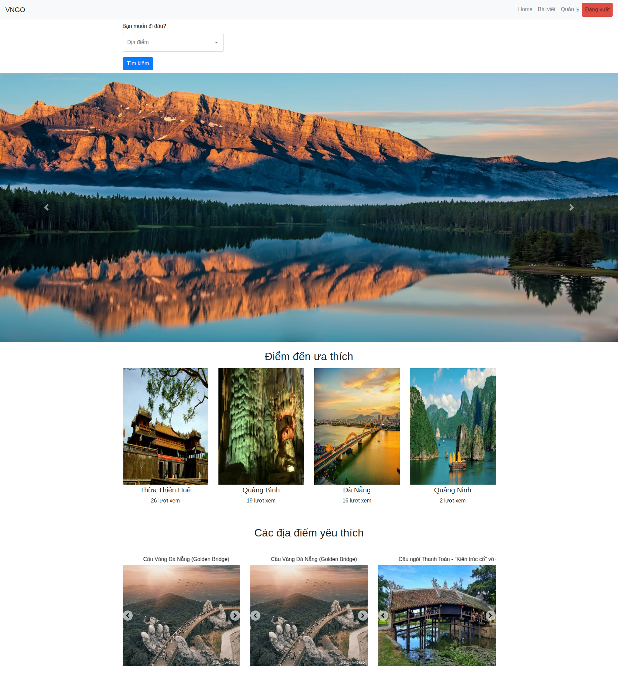
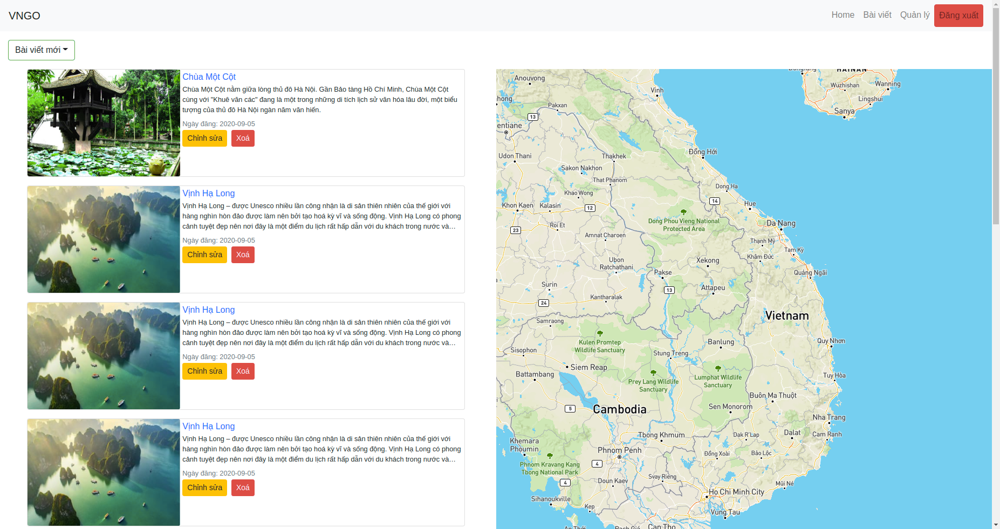

<h1 align="center">
🌐 MERN Stack
</h1>
<p align="center">
MongoDB, Expressjs, React, Nodejs
</p>

> MERN is a fullstack implementation in MongoDB, Expressjs, React, Nodejs.

MERN stack is the idea of using Javascript/Node for fullstack web development.

# Usage (run fullstack app on your machine)

## Prerequirements
- [MongoDB](https://gist.github.com/nrollr/9f523ae17ecdbb50311980503409aeb3)
- [Node](https://nodejs.org/en/download/) ^12.16.1
- [npm](https://nodejs.org/en/download/package-manager/)

notice, you need client and server runs concurrently in different terminal session, in order to make them talk to each other

## Client-side usage(PORT: 3000)
```terminal
$ cd client   // go to client folder
$ npm i       // npm install pacakges
$ npm run start // run it locally

// deployment for client app
$ npm run build // this will compile the react code using webpack and generate a folder called docs in the root level
$ npm run start // this will run the files in docs, this behavior is exactly the same how gh-pages will run your static site
```

## Server-side usage(PORT: 5000)

### Prepare your secret

run the script at the first level:

(You need to setup .env before start)
I'm use [cloudinary](https://cloudinary.com/) for storage image, you need to register it  
``` 
/.env

PORT= //server port
DATABASE_URL= // mongodb url
CLOUDINARY_URL=
CLOUDINARY_API_KEY=
CLOUDINARY_API_SECRET=
CLOUDINARY_CLOUD_NAME=
SESSION_SECRET=  // express_session
ACCESS_TOKEN_SECRET= //JWT
```

### Start

```terminal
// in root level
$ npm i       // npm install pacakges
$ npm run devStart // run localy with nodemon
```

## Deploy Server to [Heroku](https://dashboard.heroku.com/)
```terminal
$ npm i -g heroku
$ heroku login
...
$ npm run heroku-postbuild
$ heroku create
$ git push heroku main
```

# Dependencies(tech-stacks)
| Client-side              | Server-side                  |
| ------------------------ | ---------------------------- |
| material-ui              | "bcrypt": "^5.0.0"           |
| "axios": "^0.19.2"       | "body-parser": "^1.19.0"     |
| "bootstrap": "^4.5.0"    | "cloudinary": "^1.22.0"      |
| react: ^16.2.0           | "cors": "^2.8.5"             |
| react-dom: ^16.2.0       | "datauri": "^3.0.0"          |
| "jsonwebtoken": "^8.5.1" | "express": "^4.17.1"         |
| react-router-dom: ^4.2.2 | "express-session": "^1.17.1" |
| "mapbox-gl": "^1.11.0"   | "jsonwebtoken": "^8.5.1"     |
| "popper.js": "^1.16.1"   | "mongoose": "^5.9.20"        |
| .                        | "multer": "^1.4.2"           |
| .                        | "passport": "^0.4.1"         |
| .                        | "passport-local": "^1.0.0"   |
| .                        | "react-ticker": "^1.2.2"     |
| .                        | "request": "^2.88.2"         |

# Screenshots of this project

Home page


Topic detail


Search result


[See more in](/screenshots)


## Author
[Github](https://github.com/anhquandlqb2001)
Email Me: aqphan200401@gmail.com (welcome, say hi)
